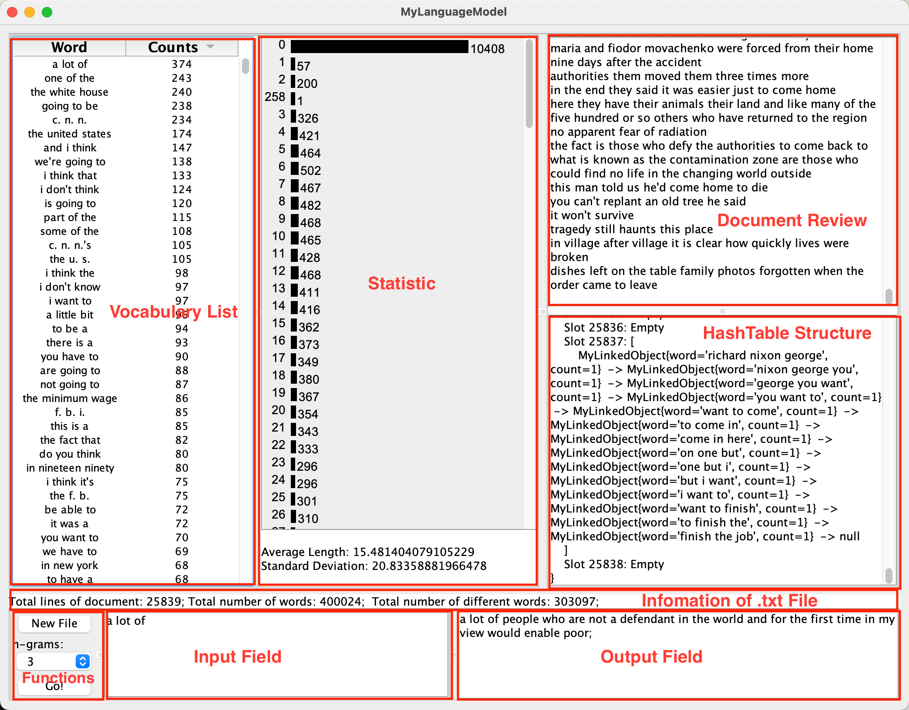

- **Vocabulary List**: The Vocabulary list shows n-gram and frequency tables.  In addition, the vocabulary can be set to be arranged in ascending or descending order by word(alphabetical order) or counts(numeric value) by clicking on the headers.
- **Statistic**: The Statistic Panel calculates the length of the linkedlist in each slot in the hash table and visualizes it to the user as a bar chart. The number on the left side of the bar represents the length of linkedList, and the number on the right represents how many times that length appears in the hash table. In addition, Statistic calculates the average length and standard deviation of linkedlist.
- **Document Review**: This panel displays the contents of the.txt file entered by the user so that the user can read the processed data against the initial data.
- **HashTable Structure**: The hash table structure module shows how the initial data is stored in the hash table in detail.
- **Functions**: The function module is a collection of functions that can be used in the program, including "New File" which allows the user to enter the.txt file that needs to be analyzed; n-grams allows the user to set which model to use to process text; "Go! The user's Input in the Input field is extracted, and the next 20 terms are predicted by the currently selected model and displayed in the Output Field.
- **Input Field**: User Input Field.
- **Output Field**: Prediction Output Field.
